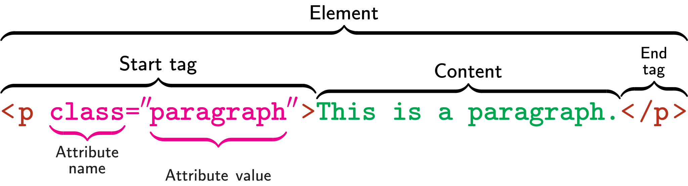

# Session 2 - 9/20/21 - Intro to HTML

- [Session [insert session number] - [insert date] - [Lecture Title]](#session-insert-session-number---insert-date---lecture-title)
  - [Announcements and Reminders](#announcements-and-reminders)
  - [Lecture Recordings](#lecture-recordings)
  - [Code from class](#code-from-class)
  - [In-class Exercises](#in-class-exercises)
  - [Assignments](#assignments)
  - [Agenda](#agenda)
  - [Class Notes](#class-notes)
    - [[Part 1]](#part-1)
    - [[Part 2]](#part-2)
    - [[Part 3]](#part-3)
    - [[Part 4]](#part-4)
    - [[Part 5]](#part-5)
  - [Closing Thoughts](#closing-thoughts)

---

## Announcements and Reminders

1. **Notetaker needed:** Here is an easy way to earn $100. A student in our class needs a notetaker, a person who is willing to share copies of their notes. To be a notetaker, you need to attend class regularly, take legible notes, and provide copies of your notes in a timely manner. Notetakers will upload their notes to the Services for Students with Disabilities MySSD web page assigned to them. It's easy! You will receive a $100 stipend after the end of the semester. If you are interested, please go to [http://www.colum.edu/](http://www.colum.edu/ssd) "Notetakers Wanted" section to sign up or click on the following link: [https://elbert.accessiblelearning.com/Colum/ApplicationNotetaker.aspx](https://elbert.accessiblelearning.com/Colum/ApplicationNotetaker.aspx) or contact the SSD office, [ssd@colum.edu](mailto:ssd@colum.edu). or 312 369-8296.

## Lecture Recordings

[specific to each class]

## Code from class

[specific to each class]

## In-class Exercises

## Assignments

## Agenda

1. Arrive to class, ask questions
2. Announcements and Reminders
3. Last week recap
4. Intro to HTML part 1
   1. What is HTML
   2. The DOM
   3. HTML Elements and tags
   4. Inline vs. block-level elements
5. Break
6. Intro to HTML part 2
   1. Semantic HTML vs. Decorative HTML
   2. `<div>` and `<span>`
   3. Neat Code and indentation
   4. Troubleshooting code with the HTML Analyzer
7. Go over in-class exercises and homework
8. Open time for work and questions

---

## Class Notes

### 1. What is HTML?

- HTML == *HyperText Markup Language*
- [w3.org: HTML History (1997)](https://www.w3.org/People/Raggett/book4/ch02.html)
- Turn off CSS styling to see pure HTML on any website (in Firefox: View --> Page Style --> No Style)
- View Page Source to see the code that makes up any page in your browser
  - Open [crouton.net](https://crouton.net)
  - To view page source in Firefox...
    - Right-click, then select 'View Page Source'
    - Windows: CTRL + U on your keyboard
    - Mac: Command + U on your keyboard
- The [DOM (Document Object Model)](https://developer.mozilla.org/en-US/docs/Web/API/Document_Object_Model/Introduction)


### 2. HTML Elements

Every HTML document requires the following elements

```html
<!DOCTYPE html>
<html>
<head>
    <title>Your Title</title>
</head>
<body>
    
</body>
</html>
```

- `<!DOCTYPE html>` - Communicates to the browser that this is an HTML document
- `<html>` - The HTML tag; everything in here is your the HTML you write
- `<head>` - Goes at the top of your document, and is for content that isn't supposed to be visible on your page. Link to things like fonts, CSS stylesheets and JavaScript libraries in this section.
- `<title>` - Goes in your `<head>` section; sets the title of your web page. You won't see this displayed on your actual web page; you'll see it in your browser tab, and when your page shows up in a search engine
- `<body>` - Where all of your page content goes. Basically, anything that you want to exist on your page should go here; 99% of the HTML we write will be in the `<body>`
- **There should only be one of each of the above elements in your HTML document.** For example, there should never be two `<body>` sections, or two `<head>` sections.

**HTML Element Diagram:**



Each HTML Element is comprised of the following:

- Start Tag
- Attribute (sometimes optional, depends on the tag)
- Content
- End Tag

Some common elements and their tags

[MDN Web Docs: HTML elements reference](https://developer.mozilla.org/en-US/docs/Web/HTML/Element)

- `<h1>` - heading 1
- `<h2>` - heading 2
- `<h3>` - heading 3
- `<h4>` - heading 4
- `<h5>` - heading 5
- `<h6>` - heading 6
- `<p>` - paragraph
- `<a>` - anchor (for links)
- `<ul>` - unordered list
- `<ol>` - ordered list
- `<li>` - list item
- `` - image

### 3. Block-level elements vs. Inline-level elements

Each HTML element is either block or inline (there's inline-block, but we'll save that for another day). An elements status as block or inline determines how the element will behave in the ***Document Flow**.* The ***Document Flow*** describes how elements flow visually from the top to the bottom of your page.

- **Block-level elements:** Most HTML elements are block-level. These take up the entire width of a row, even if the content by itself isn't wide enough to fill up a row. These elements get an entire row to themselves. (e.g. `<h1>`, `<p>`, `<ul>`, `<li>`, etc.)
- **Inline-level elements:** These elements only take up as much space as their content, and can exist *inline* with other elements. (e.g. `<a>`, ``)

### [Part 4]

### [Part 5]

---

## Closing Thoughts
